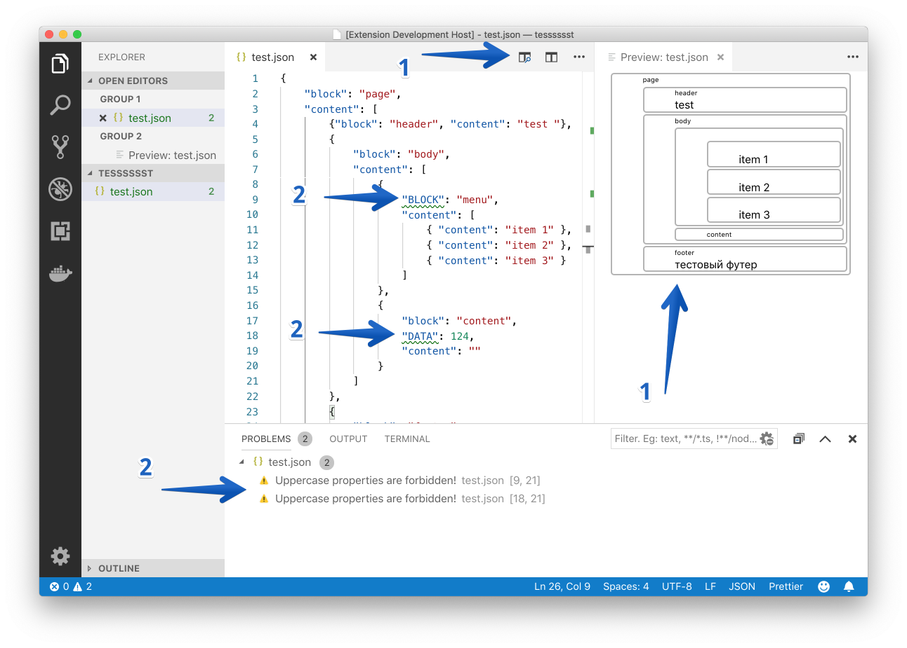

# Задание 3. Найдите ошибки

В этом репозитории находятся материалы тестового задания «Найди ошибки» для [15-й Школы разработки интерфейсов](https://yandex.ru/promo/academy/shri) (осень 2019, Москва).

Для работы приложения нужен [Node.JS](https://nodejs.org/en/) v10 или выше, а также редактор [VS Code](https://code.visualstudio.com).

## Задание

**Вам дан исходный код приложения, в котором есть ошибки. Некоторые из них стилистические, а другие даже не позволят запустить приложение. Вам нужно найти все ошибки и исправить их.**

Тестовое приложение — это плагин VS Code для удобного прототипирования интерфейсов с помощью дизайн-системы из первого задания. Вы можете описать в файле `.json` блоки, из которых состоит интерфейс. Плагин добавляет превью (1) и линтер (2) для структуры блоков.

### 1. Превью интерфейса

- Превью интерфейса доступно для всех файлов `.json`.
- Превью открывается в отдельной вкладке:
  - при выполнении команды `Example: Show preview` через палитру команд;
  - при нажатии кнопки сверху от редактора (см. скриншот);
  - при нажатии горячих клавиш **⌘⇧V** (для macOS) или **Ctrl+Shift+V** (для Windows).
- Пкладка превью должна открываться рядом с текущим редактором.
- Если превью уже открыто, то вместо открытия ещё одной вкладки пользователь должен переходить к уже открытой.
- При изменении структуры блоков в редакторе превью должно обновляться.
- Сейчас превью отображает структуру блоков в виде прямоугольников — реализуйте отображение превью с помощью вёрстки и JS из первого задания.

### 2. Линтер структуры блоков

- Линтер применяется для всех файлов `.json`.
- Линтер подсвечивает ошибочное место в файле и отображает сообщение при наведении мыши.
- Линтер отображает сообщения на панели `Problems` (**⌘⇧M** для macOS или **Ctrl+Shift+M** для Windows), сообщения группируются по файлам, при клике происходит переход к ошибочному месту.
- Сейчас плагин использует линтер-заглушку, проверяющий всего два правила: 1) «запрещены названия полей в верхнем регистре»; 2) «в каждом объекте должно быть поле `block`». Подключите в проект линтер из второго задания.

### 3. Настройки

Плагин добавляет в настройки VS Code новый раздел `Example` с параметрами:

- `example.enable` — использовать линтер;
- `example.severity.uppercaseNamesIsForbidden` — тип сообщения для правила «запрещены названия полей в верхнем регистре»;
- `example.severity.blockNameIsRequired` — тип сообщения для правила «в каждом объекте должно быть поле `block`».

Типы сообщений: `Error`, `Warning`, `Information`, `Hint`.

При изменении конфигурации новые настройки должны применяться к работе линтера.

## Как запустить

1. Открыть проект в VS Code.
2. Запустить `npm i`.
3. Нажать `F5`.

Должно открыться ещё одно окно VS Code с подключённым плагином.

## Что мы проверяем этим заданием

В этом задании мы хотим проверить вашу способность разобраться в незнакомом коде и API, а также ваш навык отладки. Пожалуйста, опишите в коде или файле README ход ваших мыслей: какие ошибки и как вы нашли, почему они возникли, какие способы их исправления существуют. Мы не ограничиваем вас в использовании сторонних инструментов и библиотек, но будем ждать от вас комментария — что и зачем вы использовали.
